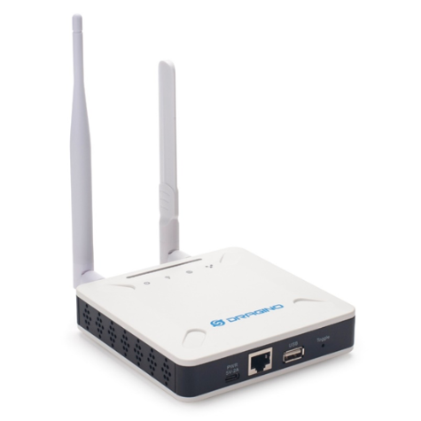

# 2. Comment mettre en place la gateway LoRaWAN ?

## Note importante

Dans notre cas, cela a eu de l'intérêt de la mettre en place. Cependant, notez qu'il est facultatif d'en posséder une si une passerelle publique se trouve dans les alentours. Afin de vérfier le coverage du réseau LoRaWAN dans votre secteur, visiter [ce site](https://ttnmapper.org/heatmap/). Notez, en plus, que le signal est plus ou moins fort selon que vous soyez en ville ou en campagne. [Si vous êtes en ville une passerelle vous sera accessible si vous vous trouvez entre 2 et 5 km de son emplacement, là où en campagne, sa portée serait plus proche de 15 km maximum.](https://enless-wireless.fr/comment-mettre-en-place-un-reseau-prive-lorawan/#:~:text=une%20longue%20port%C3%A9e%20de%202%20%C3%A0%205%20kilom%C3%A8tres%20en%20milieu%20urbain%20et%20pouvant%20atteindre%2015%20kilom%C3%A8tres%20en%20campagne) Si une passerelle se trouve en effet dans vos alentours, vous pouvez passer à la partie suivante.

[**Retour à la table des matières principale**](../README.md)  

## Mise en contexte

Dans le cas de notre projet, nous avons eu l'occasion de travailler en dehors des cours sur sa mise en place. Cependant, un problème est rapidement devenu apparent.  Nous n'avions pas de passerelle LoRaWAN publiques aux alentours. Il nous a donc fallu remédier à ce soucis en commandant notre propre passerelle LoRaWAN. Nous avons opter pour une Dragino LSP8 pour les raisons suivantes :  

+ elle a un prix relativement abordable ;  
+ elle est simple à configurer ;  
+ elle possède une interface web pour la configuration ;  
+ elle tourne sur un système d'exploitation open-source (OpenWRT)  

[**Retour à la table des matières principale**](../README.md)  

