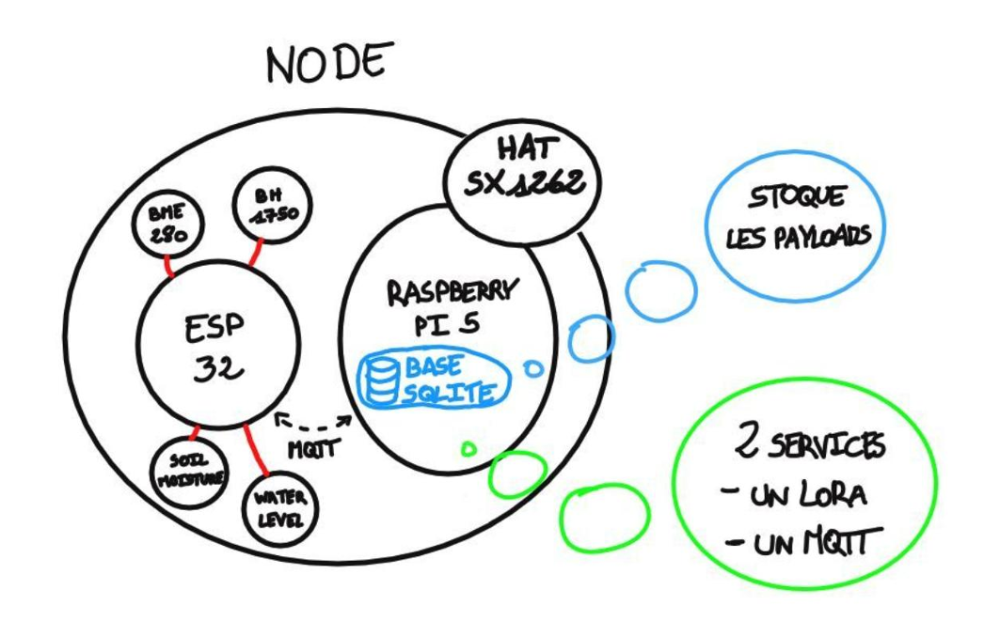

# 1. Comment mettre en place le node LoRaWAN ?

[**Retour à la table des matières principale**](../README.md)

Le node est la partie la plus importante du système car, sans cette partie, les suivantes n'ont aucune raison d'être. Nous avons utilisé un ESP32 en tant que microcontrolleur, car il ne consomme pas beaucoup d'énergie et est simple à utiliser. Nous avons, ensuite, opter pour un Raspberry Pi 5 qui allie à la fois puissance et faible consommation, en plus d'être flexible dû au fait qu'il tourne sur un distribution Linux. Nous utiliserons ses pins GPIO pour connecter notre HAT SX1262. 

## Schéma d'architecture

Voici l'allure du node sur le schéma d'architecture :

## Table des matières

[**1.1.** Comment mettre en place l'ESP32 et les capteurs ?](./esp32/README.md)  
[**1.2** Comment mettre en place la Raspberry et le HAT SX1262 ?](./raspberry/README.md)  

[**Retour à la table des matières principale**](../README.md)  