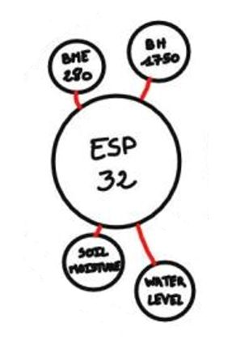
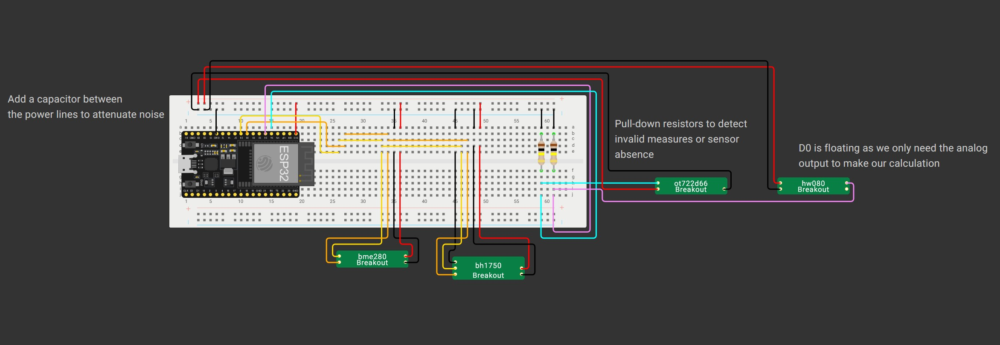

# 1.1. Comment mettre en place l'ESP32 et les capteurs ?

[**Retour à la table des matières du node**](../README.md)  
[**Retour à la table des matières principale**](../../README.md)  
<hr/>

## Schéma d'architecture  

Voici le schéma d'architecture de l'ESP32 :



## Table des matières

[**1.1.1.** Configuration de l'ESP32](#111-configuration-de-lesp32)  
[**1.1.2.** Câblage de l'ESP32 et des capteurs](#112-câblage-de-lesp32-et-des-capteurs)  
[**1.1.3.** Transfert des scripts sur l'ESP32](#113-transfert-des-scripts-sur-lesp32)  

<hr/>

### 1.1.1. Configuration de l'ESP32

Afin que l'ESP32 puisse communiquer via MQTT avec le broker se trouvant sur la Raspberry, il est nécessaire de changer l'adresse IP sur le script `data_transmitter.py` de manière à ce que l'ESP32 puisse publier dessus. Pour ce faire, sur la Raspberry Pi, exécutez soit `ifconfig` (normalement disponible par défaut dans la distrbution) ou `ip a` (qui peut nécessiter d'installer le paquet `iproute2`) afin de récupérer l'adresse IP de la Raspberry. Puis, copiez-collez simplment l'adresse à la place de la valeurs actuelle de la constante BROKER_IP_ADDRESS (ligne 15) afin que l'ESP32 utilise la bonne adresse pour communiquer avec le broker.

Si vous souhaitez utiliser la partie ESP32 sans un PC (ce qui est probablement le cas), ouvrez le script `boot.py` depuis la mémoire flash de l'ESP32 et importez le script `data_transmitter.py` en haut du fichier.

```py
import data_transmitter
```

Cela permettra à l'ESP32 de s'initialiser immédiatement au lancement et de commencer à transmettre les données du capteurs vers le topic "sensor_data" pour récupération par le client MQTT sur la Raspberry sans qu'aucune autre manipulation ne soit nécéssaire.

Dans le cas où vous essayer de tester le code, cela risque de vous gêner. Donc, pour le désactiver, ouvrez le script `boot.py`, puis commentez la ligne d'import du script `data_transmitter.py`.

Si vous êtes bloqués dans une boucle de démarrage, cliquez simplement sur la console de sortie de Thonny, puis entrez le raccourci CTRL+C plusieurs fois jusqu'à ce que l'interpréteur Python réapparaisse. Maintenant, vous pouvez reproduire la procédure précédente pour désactiver l'exécution du script au démarrage.

### 1.1.2. Câblage de l'ESP32 et des capteurs

Voici le schéma de câblage de l'ESP32 et des capteurs sur Wokwi :

  

Dans le cas où vous voulez utiliser une batterie au lieu de connecter l'ESP32 directement à un ordinateur, utilisez un convertisseur de tension configuré pour sortir du 5V puis branchez le câble GND sur le GND du bus d'alimentation et le câble VCC sur le pin 5V de l'ESP32 (et non sur le bus d'alimentation qui doit fournir du 3,3V aux capteurs !).

### 1.1.3. Transfert des scripts sur l'ESP32

Dans notre cas, nous avons utilisé Thonny pour transférer les fichiers mais vous êtes libre d'utiliser n'importe quel outils qui permettent de transférer des fichiers sur la mémoire Flash de l'ESP32.

**1.** Ouvrez Thonny ;  
**2.** Branchez l'ESP32 de destination sur l'un des ports USB disponibles de votre ordinateur ;  
**3.** Ouvrez chaque scripts se trouvant dans le dossier `micropython-scripts` dans l'éditeur ;  
**4.** Pour chaque script, entrez le raccourci clavier CTRL+SHIFT+S et choisissez "MicroPython device" ;  
**5.** Gardez le même nom de script et terminez le transfert  

À partir de maintenant, l'ESP32 est connectée à tout les capteurs et peut enregistrer des mesures depuis les capteurs. Une fois cela fait, elle publiera les résultat sur le topic "sensor_data" via le borker MQTT sur la Raspberry et auquel la Raspberry elle-même est souscrite pour réceptionner les données.

<hr/>

[**Retour à la table des matières du node**](../README.md)  
[**Retour à la table des matières principale**](../../README.md)  

<hr/>